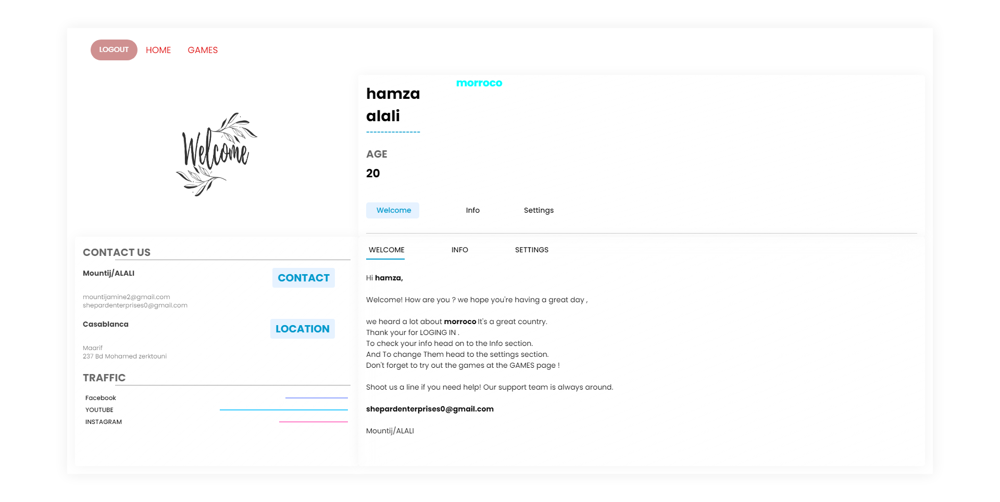

<a id="readme-top"></a>

<!-- PROJECT LOGO -->
<br />
<div align="center">


  <h3 align="center">Gamenow</h3>

  <p align="center">
    A centralized platform where users can access and play a variety of small, web-based games.
  </p>
</div>

<!-- TABLE OF CONTENTS -->
<details>
  <summary>Table of Contents</summary>
  <ol>
    <li>
      <a href="#about-the-project">About The Project</a>
      <ul>
        <li><a href="#built-with">Built With</a></li>
      </ul>
    </li>
    <li><a href="#screenshots">Screenshots</a></li>
    <li>
      <a href="#getting-started">Getting Started</a>
      <ul>
        <li><a href="#prerequisites">Prerequisites</a></li>
        <li><a href="#installation">Installation</a></li>
      </ul>
    </li>
    <li><a href="#contact">Contact</a></li>
  </ol>
</details>

<!-- ABOUT THE PROJECT -->
## About The Project

<a href="https://github.com/Hamza-Alali-0/Gamenow">
    
</a>

Gamenow is a centralized platform where users can access and play a variety of small, web-based games. The platform is designed to provide a fun and engaging experience for users while being beginner-friendly and easy to navigate.

Here's why Gamenow stands out:
- **Centralized Game Access**: Users can play multiple games directly in their browser without needing to download or install anything.
- **Interactive and Fun**: The games are built with interactive features and engaging gameplay to keep users entertained.
- **Beginner-Friendly**: The platform is designed to be simple and intuitive, making it accessible to users of all skill levels.

Gamenow aims to provide a seamless and enjoyable gaming experience by combining a variety of games into one easy-to-use platform.

### Built With

This project is built with the following technologies:

* [![HTML][HTML.com]][HTML-url]
* [![CSS][CSS.com]][CSS-url]
* [![JavaScript][JavaScript.com]][JavaScript-url]
* [![PHP][PHP.com]][PHP-url]
* [![MySQL][MySQL.com]][MySQL-url]

<!-- Reference-style links for images -->
[HTML.com]: https://img.shields.io/badge/HTML-E34F26?style=for-the-badge&logo=html5&logoColor=white
[HTML-url]: https://developer.mozilla.org/en-US/docs/Web/HTML
[CSS.com]: https://img.shields.io/badge/CSS-1572B6?style=for-the-badge&logo=css3&logoColor=white
[CSS-url]: https://developer.mozilla.org/en-US/docs/Web/CSS
[JavaScript.com]: https://img.shields.io/badge/JavaScript-F7DF1E?style=for-the-badge&logo=javascript&logoColor=black
[JavaScript-url]: https://developer.mozilla.org/en-US/docs/Web/JavaScript
[PHP.com]: https://img.shields.io/badge/PHP-777BB4?style=for-the-badge&logo=php&logoColor=white
[PHP-url]: https://www.php.net/
[MySQL.com]: https://img.shields.io/badge/MySQL-4479A1?style=for-the-badge&logo=mysql&logoColor=white
[MySQL-url]: https://www.mysql.com/

<p align="right">(<a href="#readme-top">back to top</a>)</p>


<!-- SCREENSHOTS -->
## Screenshots

Here are some screenshots of the project:

| ![login Page][login-screenshot] | ![Signup Page][Signup-screenshot] | ![Games Page][Games-screenshot] |
|-------------------------------|----------------------------------|----------------------------------|
| **login Page**                 | **signup Page**                  | **Games Page**                  |


<!-- Reference-style links for images -->
[login-screenshot]: Assets/login.png
[Signup-screenshot]: Assets/signup.png
[Games-screenshot]: Assets/games.png


<p align="right">(<a href="#readme-top">back to top</a>)</p>

<!-- GETTING STARTED -->
## Getting Started

To get a local copy up and running, follow these simple steps.

### Prerequisites

Before you begin, ensure you have the following installed:
- [XAMPP](https://www.apachefriends.org/index.html) (includes PHP, MySQL, and Apache)
- A modern web browser (e.g., Chrome, Firefox)

### Installation

1. **Install XAMPP**:
   - Download and install XAMPP from the [official website](https://www.apachefriends.org/index.html).
   - Start the Apache and MySQL services from the XAMPP Control Panel.

2. **Clone the repository**:
   ```sh
   git clone https://github.com/Hamza-Alali-0/Gamenow.git

3. **Import the sql Database to Xampp(mySql)**:
  - database1.sql.


<a id="contact"></a>
## Contact

Hamza Alali - [hamza.alali.dev@gmail.com](mailto:hamza.alali.dev@gmail.com)


Connect with me:
- <a href="https://dev.to/@hamzaalali0" target="_blank"></a>
- <a href="https://www.linkedin.com/in/hamza--alali" target="_blank"></a>
- <a href="https://github.com/hamza-alali-0" target="_blank"></a>
- <a href="https://www.instagram.com/alalihamza.0/" target="_blank"></a>

Project Link: [https://github.com/Hamza-Alali-0/Gamenow](https://github.com/Hamza-Alali-0/Gamenow)

<p align="right">(<a href="#readme-top">back to top</a>)</p>
   
